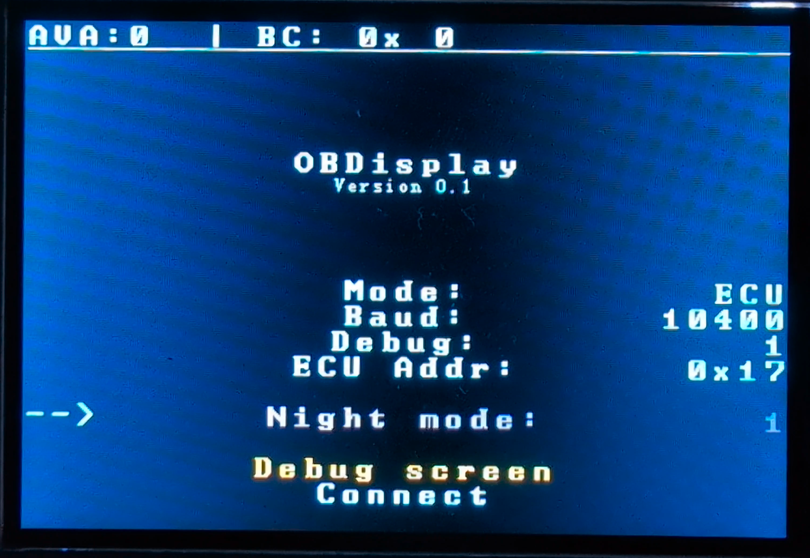
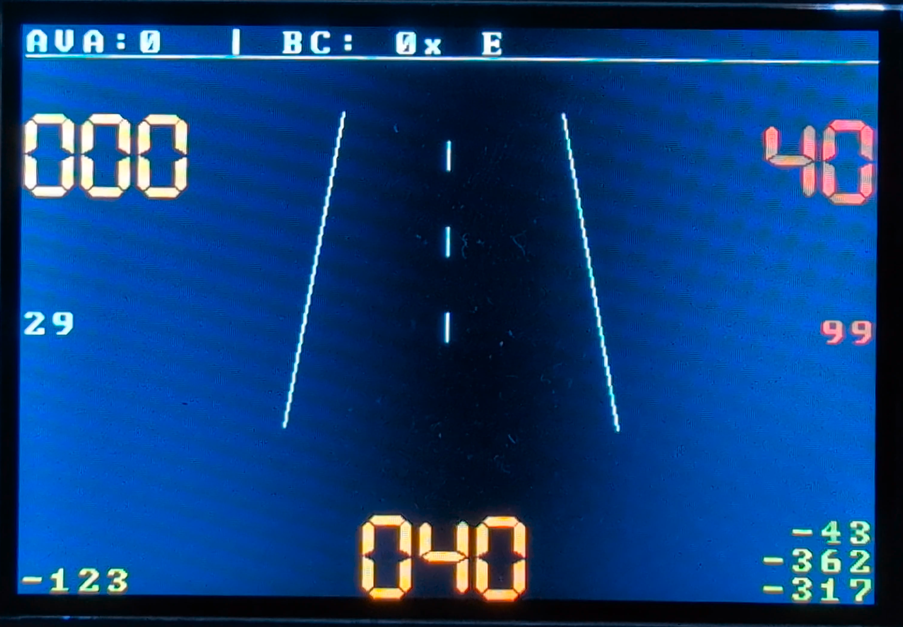

# OBDisplay — KWP-1281 Trip Computer for VAG Vehicles

Live trip computer and diagnostics for VAG vehicles (Golf Mk4, Bora, Jetta, ~1998–2006) using the K-Line OBD interface and the KWP-1281 protocol. Displays sensor data (speed, RPM, temperatures, fuel level, consumption) and reads/clears DTC fault codes.

## Projects

| Project | Hardware | Status | Notes |
|---|---|---|---|
| **OBDisplay-Uno** | Arduino Uno + 64×128 OLED | ✅ Recommended | Full-featured, stable. Software Serial avoids timing issues. |
| **OBDisplay-Mega** *(this repo, `src/`)* | Arduino Mega + 480×320 TFT | ⚠️ Experimental | Large colour display. Known HardwareSerial timing issues with some ECUs. |
| **OBDisplay-Emu** | Arduino Mega | 🔧 Dev tool | KWP-1281 ECU emulator for bench testing without a real car. |

> For a production deployment, use **[OBDisplay-Uno](https://github.com/RXTX4816/OBDisplay-Uno)**. The Mega variant is functional but HardwareSerial timing on the ATmega2560 can cause intermittent connection failures with some ECUs.

---

## OBDisplay-Mega

### Features

- 480×320 full-colour TFT display
- 6 menus: Cockpit, Experimental, Group Reading, DTC, Settings, Debug
- Supported baud rates: 1200, 2400, 4800, 9600, 10400
- 3 KWP operating modes: ACK (keepalive), Group reading, Sensor reading
- Read and clear DTC fault codes
- Day / night display modes
- EEPROM persistence (baud rate, ECU address, night mode)
- 7-button navigation (UP / DOWN / LEFT / RIGHT / MID / SET / RST)

### Hardware requirements

- Arduino Mega (ATmega2560-16AU)
- 3.5" 480×320 TFT LCD shield (ILI9486 / ILI9488, 16-bit parallel, 5V-tolerant)
- 7-way joystick button module
- Modified KKL OBD-to-USB cable (FT232R or FT232RQ)

### Quick pinout

| Signal | Pin |
|---|---|
| K-Line TX | 14 (TX3) |
| K-Line RX | 15 (RX3) |
| SET button | 2 |
| MID button | 3 |
| RIGHT button | 4 |
| LEFT button | 5 |
| DOWN button | 6 |
| UP button | 7 |
| RST button | 13 |

All button pins use `INPUT_PULLUP` (connect button between pin and GND). The TFT shield plugs directly onto the Mega headers.

Full hardware details, wiring diagrams, and K-Line cable modification steps: **[docs/wiki/Hardware-Setup](docs/wiki/Hardware-Setup.md)**

### Installation

**Dependency** — [KLineKWP1281Lib](https://github.com/domnulvlad/KLineKWP1281Lib) is included as a git submodule:

```sh
git submodule update --init
```

**Build and flash:**

```sh
pip install --upgrade platformio   # or: sudo pacman -S platformio-core
pio run -e mega --target upload
```

Or use the PlatformIO VS Code extension.

### Documentation

**[docs/wiki/](docs/wiki/Home.md)** — full wiki covering every screen, menu, and setting.




---

## ECU Emulator

`OBDisplay-Emu/` (also at [github.com/RXTX4816/OBDisplay-Emu](https://github.com/RXTX4816/OBDisplay-Emu)) turns a second Arduino Mega into a KWP-1281 ECU emulator. Flash it to test the display and menus without a car. It emulates address `0x17` at 10400 baud with simulated sensor data including a basic drive-cycle physics model.

---

## Label files

Each ECU version maps different signals to different measurement group slots. To find the mapping for your car, locate the label file for your ECU part number (e.g. `036-906-034-AM.LBL` for the 1.4 16V Marelli engine ECU):

- [Ross-Tech VCDS label file archive](https://www.ross-tech.com/vcds/label-files/)
- Connect VCDS and record the raw group outputs while driving to build your own mapping

---

## Credits

[Blafusel](https://www.blafusel.de/obd/obd2_kw1281.html) — detailed KW1281 protocol documentation.

[mkirbst](https://github.com/mkirbst/lupo-gti-tripcomputer-kw1281) — original KW1281 trip computer reference implementation.

[domnulvlad](https://github.com/domnulvlad/KLineKWP1281Lib) — KLineKWP1281Lib, the KWP-1281 library this project depends on.

---

## Caution

> Use at your own risk. Incorrect wiring can damage the ECU or create a fire hazard. The OBD port was designed for periodic diagnostics; keeping a continuous connection increases ECU workload. Do **not** access airbag address `0x15` — on some ECUs with pre-existing electrical faults, clearing DTCs can trigger airbag deployment. This software only reads measurement groups and DTCs; it does not perform adaptations or logins. Contributions and issues welcome.
